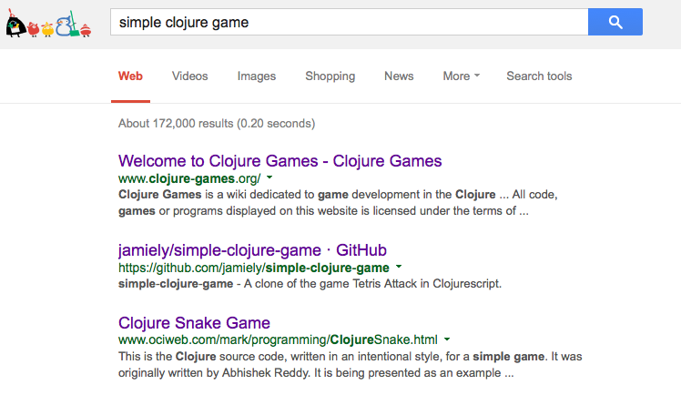

### Things should just work

I started playing with Clojure on and off a few months ago. It looked like an 
excellent language, and I soon saw that it gave elegant solutions to math
puzzles in the style of [Project Euler](https://projecteuler.net/). The next
thing I wanted to see was GUI interaction. It is always satisfying to see one's
tools effect change in the real world, and seeing changes outside the terminal is a
close second place. 
How would Clojure go about making changes
there, and would both the coding and the resulting code be as smooth as in the
purely textual case?

Clojure shares the Java miracle of hosting itself on a virtual machine, so I assumed
that if I searched Google for a "simple clojure game", then I could download one right
away, and that within five minutes I would be playing it. My virtual machine is same
by definition, so things should *just work*. Unfortunately, I wasn't so lucky. 

Today I tried the Google search again. I have by now already written a GUI game in Clojure
(which I'll show at the end of this post). But I wanted to see, armed with more knowledge
this time around, if I could perhaps fix things that earlier I had judged as irrevocably
broken. Plus, I thought it would be good to document what I went through. 
Here are the first three results from the Google search:

Here's [the] [relevant] [links], for those too lazy to type in the links, but motivated
enough to want to explore them. 
Kudos to these guys for putting Clojure code online. I'm doing the same thing now, 
so I feel a bit of a connection. It's just a shame that their stuff just doesn't work. Or at
least it didn't work for me. Here are some highlights for people who are into that kind of thing:
one for each of the three links, respectively.

`WARNING: Cannot locate native library: macosx/liblwjgl.dylib`
`WARNING: Use of undeclared Var attack.grid/fall-map at line 499 src/cljs/crossovers/attack/grid.cljs`
`Exception in thread "main" java.lang.ClassNotFoundException: snake.core`

It is generally true that, as the time invested approaches infinity, all bugs shall be
resolved. Now, I don't know how passionate you are about devoting time to random things on the
internet not working, but I saw the first error as a ray of grace. Ooh, a dynamic library 
linking error... For me the decision was clear: *NEXT*! Begone, time vaccuum! 

So I spent some time downloading the repo, navigating to the directory, checking his README, 
following his instructions, running the code, and looking at the stack traces. But all in all, 
not too bad. I am thankful that I can quickly cut my losses and move to round 2. There it was a
similar story. I spent some time setting things up and following his instructions, but then
I got a stack trace complaining of an undefined variable in code that I didn't write. I was
curious enough to at least look at the relevant source file,
but upon doing so, I realized I didn't care
enough to go down the rabbit hole of figuring out why *his* code isn't working (since my mission,
of course, is to find and deconstruct a working, Clojure-driven GUI, and dealing with broken
things steals from the finite free time available for doing so).

Finally, I reached the third page, which ended up being pretty ancient. An inspection of its
source shows what looks like hand-crafted HTML. His steps for running the code show it was
clearly written before [Leiningen](http://leiningen.org/). The code also required something from the 
deprecated clojure.contrib library. So the `java.lang.ClassNotFoundException: snake.core` error
tricked me into thinking that I messed up the Leiningen project I built to wrap arround his code. 
It seemed to me that snake.core *itself* was not being found. Anyway, more time wasted. 
But in the end, with some extra heckling I got it to work. (Yes, I prefer *heckling* to *hacking*
here. This work was the kludgy and uninspiring sort, but *hacking* in contrast deserves connotations of
excellence. *Heckling* is appropriate for its description of the natural tendency for one to taunt and insult
the computer when it fails to work under such circumstances, and lucky for its phonetic similarity.)

The snake moves. For some reason, it successfully eats the pellet even when it misses it by one
grid box. But oh well, I guess that's life. 

### Something that works

Surely there are other resources out there that I didn't explore. Maybe what I did explore will
work on other people's machines. But dammit, we're running on the JVM! Why can't things just
work? 

To make these efforts something more than slapstick humor, here is my humble offering of 
something that just works. 

